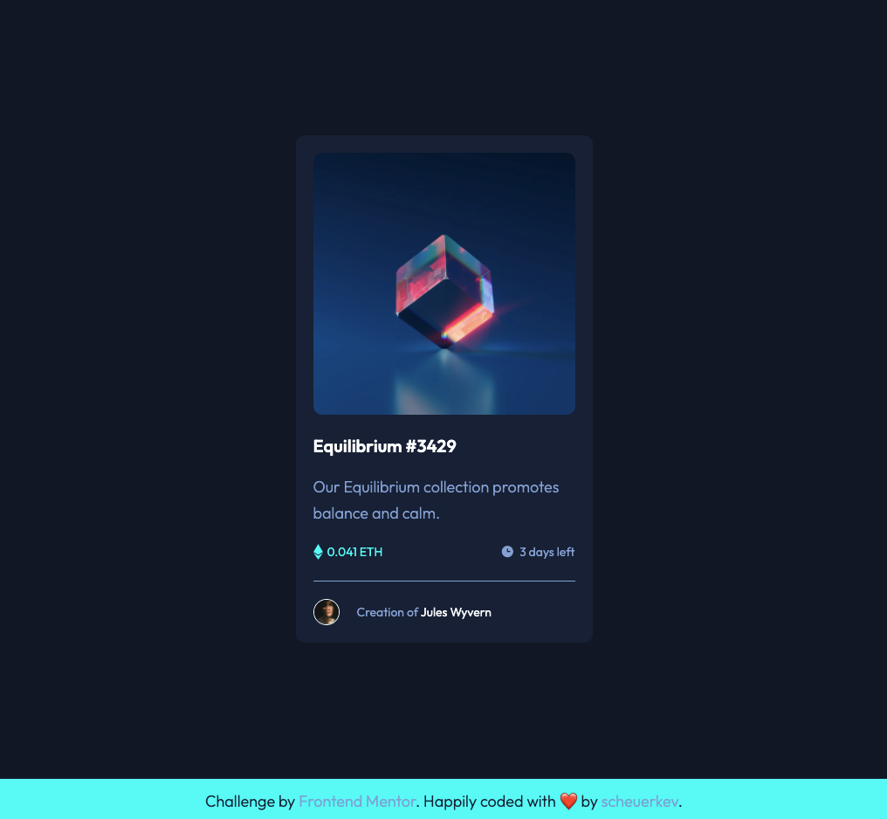

# Frontend Mentor - NFT preview card component solution

This is a solution to the [NFT preview card component challenge on Frontend Mentor](https://www.frontendmentor.io/challenges/nft-preview-card-component-SbdUL_w0U). Frontend Mentor challenges help you improve your coding skills by building realistic projects.

## Table of contents

- [Overview](#overview)
    - [The challenge](#the-challenge)
    - [Screenshot](#screenshot)
    - [Links](#links)
- [My process](#my-process)
    - [Built with](#built-with)
    - [Useful resources](#useful-resources)
- [Author](#author)

## Overview

### The challenge

Users should be able to:

- View the optimal layout depending on their device's screen size
- See hover states for interactive elements

### Screenshot

### Links

- Source code URL: [Here](https://github.com/scheuerkev/NFT-preview-card-component)
- Live Site URL: [Here](https://scheuerkev.github.io/NFT-preview-card-component/)

## My process

### Built with

- Semantic HTML5 markup
- Flexbox Layout
- Mobile-first workflow
- CSS Pseudo elements

### Useful resources

- [Applying flexbox to center pseudo-elements with flexbox](https://www.bennadel.com/blog/3857-applying-css-flexbox-to-pseudo-elements.htm) - Well explanations of how to apply flexbox to pseudo-elements properly

## Author

- Frontend Mentor - [@scheuerkev](https://www.frontendmentor.io/profile/scheuerkev)
- Twitter - [@scheuerkev](https://www.twitter.com/yourusername)
